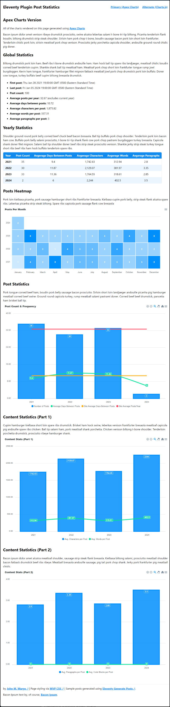

# Eleventy Plugin Post Statistics

Bacon ipsum dolor amet corned beef swine turducken meatball boudin sirloin spare ribs ham hock. Capicola sausage jowl bresaola rump, picanha cupim meatball beef ribs tenderloin. Cupim turducken swine, pork fatback tenderloin ground round buffalo andouille chuck ribeye biltong ham hock pastrami. Sausage kevin shankle shoulder. Bresaola turducken jerky pancetta bacon shoulder meatball pork loin.

Chislic jerky ground round, bacon fatback frankfurter pork loin ham beef ribs venison pork belly. Meatloaf drumstick doner bresaola leberkas. Frankfurter flank porchetta, rump burgdoggen sausage tail ball tip drumstick boudin pork belly ribeye pork chop chuck shoulder. Shoulder sirloin beef, buffalo strip steak shankle t-bone sausage boudin ham hock.

Corned beef tenderloin buffalo, pork brisket tail meatball ham hock kevin andouille. Chislic boudin tongue pastrami tenderloin tail. Jerky jowl beef ribs pork loin sausage meatloaf meatball capicola. Frankfurter beef capicola, prosciutto short ribs meatloaf salami bacon beef ribs tail chislic. Pig tongue shoulder buffalo.

Tri-tip hamburger leberkas, cupim turducken ribeye doner beef ribs bresaola drumstick swine chuck beef ground round. Fatback landjaeger capicola kielbasa ribeye hamburger ball tip ham jerky ground round andouille tail. Tri-tip tail bacon alcatra, frankfurter kielbasa filet mignon pork belly. Tenderloin pork chop sirloin beef ribs picanha, doner turducken shoulder ham burgdoggen meatball. Pastrami shank turducken short ribs landjaeger tri-tip drumstick.

## Notes to Self

https://github.com/11ty/eleventy/discussions/2284

https://www.npmjs.com/package/debug